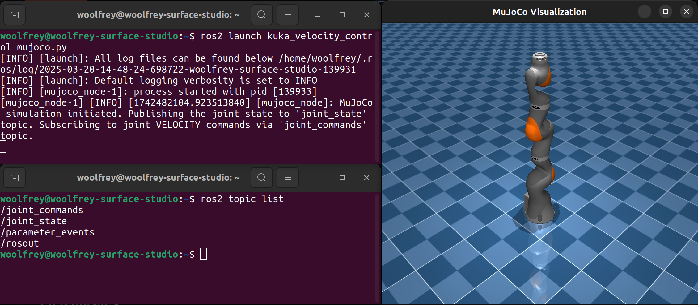
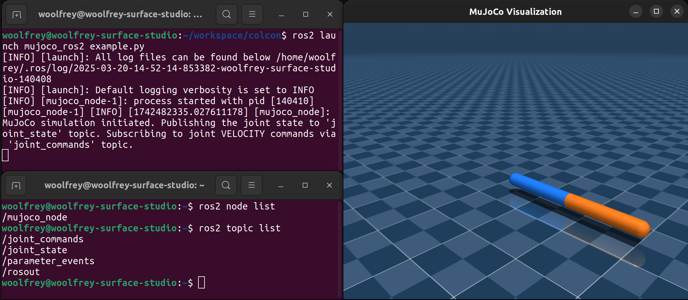

# :bridge_at_night: MuJoCo - ROS2

This package enables a basic MuJoCo simulation environment with ROS2 communication channels for controlling a robot. It publishes a `sensor_msgs/msg/JointState` topic containing the position, velocity, and effort of the joints, and accepts commands via a `std_msgs::Float64MultiArray` topic. It can run in `POSITION`, `VELOCITY`, or `TORQUE` mode which can be set as a parameter in a launch file.

<p align="center">
   
   <br>
   <em>Figure 1: Your custom control node can interact with the mujoco node through two topics.</em>
</p>

>[!TIP]
> There are many robot models available in the [Google DeepMind MuJoCo Menagerie](https://github.com/google-deepmind/mujoco_menagerie.git).

<p align="center">
   
   <br>
   <em>Figure 2: The Kuka iiwa14 model from the MuJoCo Menagerie.</em>
</p>

#### :compass: Navigation

- [Dependencies](#link-dependencies)
- [Installation](#floppy_disk-installation)
- [Launching the Simulation](#rocket-launching-the-simulation)
- [Contributing](#handshake-contributing)
- [License](#scroll-license)

[:top: Back to top.](#bridge_at_night-mujoco---ros2)

## :link: Dependencies

- [Ubuntu 22.04](https://ubuntu.com/download/desktop) or later,
- [ROS2](https://docs.ros.org/en/humble/index.html) (Humble Hawksbill or later)
- [MuJoCo 3.2.0](https://mujoco.org/) or later, and
- [GLFW](https://github.com/glfw/glfw) for visualisation.

> [!NOTE]
> This package was built and tested with Ubuntu 22.04, using ROS2 Humble Hawksbill, and MuJoCo 3.2.0.

[:top: Back to top.](#bridge_at_night-mujoco---ros2)

## :floppy_disk: Installation

### Prerequisites

Ensure that you have ROS2 and MuJoCo installed on your system.

1. **Install ROS2:**
   
   Follow the [ROS2 installation guide](https://docs.ros.org/en/foxy/Installation.html) for your operating system.

2. **Install MuJoCo:**
   
   Download and install MuJoCo from the [official website](https://mujoco.org/).

   Mine is installed in `/opt/mujoco/mujoco-3.2.0`

   Next, modify your `.bashrc` file:
   ```
   gedit ~/.bashrc
   ```
   Add the following lines of code at the bottom:
   ```
   export MUJOCO_PY_MUJOCO_PATH=/opt/mujoco/mujoco-3.2.0
   export LD_LIBRARY_PATH=$LD_LIBRARY_PATH:/opt/mujoco/mujoco-3.2.0/bin
   export LD_LIBRARY_PATH=/opt/mujoco/mujoco-3.2.0/lib:$LD_LIBRARY_PATH
   ```
   Change all instances of `opt/mujoco/mujoco-3.2.0` to match your installation location, and your version.

4. **Install GLFW:**
```
   sudo apt-get install libglfw3-dev
```

[:top: Back to top.](#bridge_at_night-mujoco---ros2)

### Building the Project

In the `src/` directory of your ROS2 workspace, clone the repository:
```
git clone https://github.com/Woolfrey/mujoco_ros2
```
Your directory structure should look something like this:
```
ros2_workspace/
├── build/
├── install/
├── log/
└── src/
    └── mujoco_ros2/
        ├── include/
        ├── launch/
        ├── model/
        ├── src/
        ├── CMakeLists.txt
        ├── LICENSE
        ├── package.xml
        └── README.md
```

In `CMakeLists.txt` you need to tell the compiler where to find the MuJoCo header files:
```
set(MUJOCO_PATH "/opt/mujoco/mujoco-3.2.0") # UPDATE THIS TO YOUR MUJOCO PATH
include_directories(${MUJOCO_PATH}/include/mujoco)                                                  # MuJoCo header files
include_directories(${MUJOCO_PATH}/include)                                                         # Additional MuJoCo header files
link_directories(${MUJOCO_PATH}/lib)                                                                # Location of MuJoCo libraries
```
As noted above, mine is installed in `/opt/mujoco/mujoco-3.2.0` but you should change it to match your directory and version.

Navigate back to the root of your ROS2 workspace and build the package:
```
colcon build --packages-select mujoco_ros2
```
Source the ROS2 workspace:
```
source install/setup.bash
```

[:top: Back to top.](#bridge_at_night-mujoco---ros2)

## :rocket: Launching the Simulation

There is a simple launch file that demonstrates how to run it in `mujoco_ros2/launch/example.py`. It launches the node:
```
    mujoco = Node(
        package    = "mujoco_ros2",
        executable = "mujoco_node",
        output     = "screen",
        arguments  = [xmlScenePath],
        parameters = [   
                        {"joint_state_topic_name" : "joint_state"},
                        {"joint_command_topic_name" : "joint_commands"},
                        {"control_mode" : "VELOCITY"},
                        {"simulation_frequency" : 1000},
                        {"visualisation_frequency" : 20},
                        {"camera_focal_point": [0.0, 0.0, 0.25]},
                        {"camera_distance": 2.5},
                        {"camera_azimuth": 135.0},
                        {"camera_elevation": -20.0},
                        {"camera_orthographic": True}
                     ]
    )
```

The `argument = [xmlScenePath]` requires a valid MuJoCo xml file. For this example, it utilizes the local `model/scene.xml` file. There are lots of other models in the [MuJoCo Menagerie](https://github.com/google-deepmind/mujoco_menagerie) that you can use.

The `parameter` argument can be changed based on your preferences:
| Argument | Purpose |
|----------|---------|
| joint_state_topic_name | This sets the name of the topic for the joint state publisher. Your ROS2 robot control node should subscribe to this topic as a `sensor_msgs/JointState`. |
| joint_command_topic_name | This sets the topic name that the node will subcsribe to for receiving joint commands. Your ROS2 robot control node should publish to this as a `std_msgs/Float64MultiArray`. |
| control_mode | This is a string that sets what type of commands are sent to the joints. Options are POSITION, VELOCITY, or TORQUE. |
| simulation_frequency | This is used to set the update rate of the underlying MuJoCo simulation. |
| visualisation_frequency | This is how fast the 3D rendering should be refreshed. In general it should be much lower than the simulation frequency. |
| camera_focal_point | A position in the 3D world that the camera looks at. |
| camera_distance | How far the camera is from the focal point. |
| camera_azimuth | A clockwise rotation of the camera viewing angle. |
| camera_elevation | The tilt of the angle from the ground plane. |
| cmaera_orthographic | Controls the type of projection. Can be `True` or `False`. |

After you've installed the package, and sourced the workspace, you can run:
```
ros2 launch mujoco_ros2 example.py
```

And you should see the following:

<p align="center">
   
   <br>
   <em>Figure 3: Using the launch example generates a 2-link planar robot, with ROS2 communication channels.</em>
</p>

You can check the topics are available, and see the output for the joint state being published:
```
ros2 topic list
ros2 topic echo /joint_state
```

You can alter the parameters to your liking.

> [!NOTE]
> So far I've only tested VELOCITY mode robustly. TORQUE mode did work, but my controller hadn't been properly tuned. It will be double-checked in the near future.

[:top: Back to top.](#bridge_at_night-mujoco---ros2)

## :handshake: Contributing

Contributions to this repositore are welcome! Feel free to:
1. Fork the repository,
2. Implement your changes / improvements, then
3. Issue a pull request.

If you're looking for ideas, you can always check the [Issues tab](https://github.com/Woolfrey/mujoco_ros2/issues) for those with :raising_hand: [OPEN]. These are things I'd like to implement, but don't have time for. It'd be much appreciated, and you'll be tagged as a contributor :sunglasses:

[:top: Back to top.](#building_construction-software-template-repository)

## :scroll: License

This software package is licensed under the [GNU General Public License v3.0 (GPL-3.0)](https://choosealicense.com/licenses/gpl-3.0/). You are free to use, modify, and distribute this package, provided that any modified versions also comply with the GPL-3.0 license. All modified versions must make the source code available and be licensed under GPL-3.0. The license also ensures that the software remains free and prohibits the use of proprietary restrictions such as Digital Rights Management (DRM) and patent claims. For more details, please refer to the [full license text](LICENSE).

[:top: Back to top.](#building_construction-software-template-repository)
